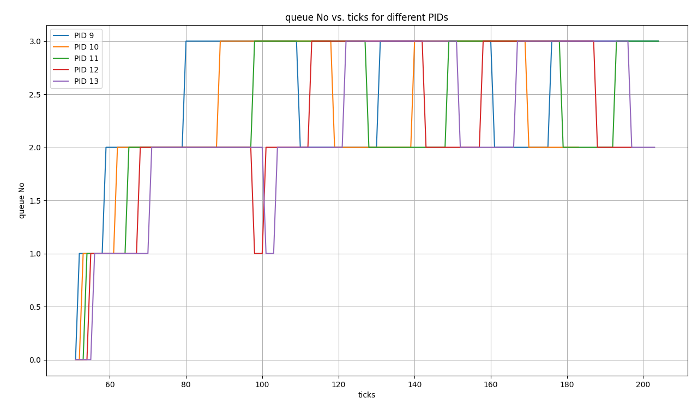

<!-- [](https://classroom.github.com/a/DLipn7os) -->
# Intro to Xv6
in this project we are adding some features to xv6 operating system.


## applied features
``system calls``
- getreadcount
- sigalarm
- sigreturn

``schedulers``
- FCFS scheduler
- MLFQ scheduler

``report of schedulers``
- report of FCFS and MLFQ schedulers

# Implementation

## System calls
- we have added three system calls to xv6 operating system.

``getreadcount``
- this system call returns the number of read system calls that the calling process has made so far.

``sigalarm and sigreturn``
- in this system calls we have implemented the alarm and the signal system calls , in system call `sigalarm` we have added a new signal handler to the calling process and in system call `sigreturn` we have returned the calling process to the previous signal handler. The sigalarm sets the ticks of current process to zero and counts n ticks to call a specific function. These ticks once covered, will make the process to switch the context from current process to the required function. The current process status is saved to its trapfram_copy. This is restored as the function completion is followed by call for sigreturn() that restores the process's trapframe to its trapfram_copy. This way the previous state is reached and the process executes like before, while the controll rolls back to process p.

# schedulers
- we have added two schedulers to xv6 operating system.
## FCFS scheduler
- this scheduler is a simple scheduler that runs the processes in the order they arrive.
- in this scheduling algorithm the we traverse in the process list and select the process which is in state of the runnable ans also with the lowest creation time and after that we run the process and wait for it to finish.
- so for FCFS we have to change the `scheduler()` function in `proc.c` file and the `trap()` function in `trap.c` file and in `usertrep()` we process `yield()` system call only for the NON FCFS schedulers because in FCFS we need to complete the process.

``FCFS algorithm``
- all the processes are stored in the process list in the order they arrive.
- we traverse in the process list and select the process which is in state of the runnable.
- we select the process with the lowest creation time.
- after selecting the process we make the context switch is performe and give control to the kernel.
- in the trep.c we give not call yield() system call because we need to complete the process.
- we run the process and wait for it to finish.
- we repeat the previous steps until all the processes are finished.

# MLFQ scheduler
- in this scheduler we run the processes in the order they arrive but we have 4 queues with different priorities and the processes with higher priority will run first in our case we have 4 queues with different priorities que 0 is the highest priority and que 3 is the lowest priority.
- in the first queue the time slice is 1 tick and in the second queue the time slice is 3 ticks and in the third queue the time slice is 9 ticks and in the fourth queue the time slice is 15 ticks.
- in each queue we run the processes in each que for some ticks which is predefinded.
- in this scheduling we also use the aging technique to avoid starvation.
- so for MLFQ in the `trap()` function in `trap.c` file and in `usertrep()` we process `yield()` system call only when the ticks of that process is more than the time slice of that queue.
- we also perform the change in the que of the process when the ticks of that process is more than the time slice of that queue.

`MLFQ algorithm`
- all the processes are stored in the process list in the order they arrive.
- we traverse in the process list and push the all the processes in the queue 0 and process mush be in the state of the runnable.

<br>

```Agging```
- we also check the case of the `Agging` if the ticks of the process is more than 30 ticks then we perform the priority boost and push that process in the queue which has one higher priority than the previous queue.
- now we select the process from the process which is in the highest priority queue and also in the state of the runnable.
- now we the context switch is performe and give control to the kernel.

<br>

```Priority Change```
- in the trep.c we give not call yield() system call when the ticks of that process is more than the time slice of that queue.
- when the ticks of that process is more than the time slice of that queue we perform the change in the que of the process.
- for the que 0 the time slice is 1 tick and for the que 1 the time slice is 3 ticks and for the que 2 the time slice is 9 ticks and for the que 3 the time slice is 15 ticks.
- we pop the process from the queue and push it again in the queue which is one level lower than the previous queue.
- but for the que 3 we don't perform the change in the queue only when the ticks of that process is more than the time slice of that queue we pop the process from the queue and push it again in the queue 3.

<br>

```check for the higher priority process```
- in the usertrep() we also check that if any process which iss present in the queue which has higher priority than the current process's queue the we call the yield() system call.
now this process will be pushed at the front of the queue.

- in usertrapret() we increase wtime of the all the process other than the current process by 1 ticks.
- after the completion of the process we repeat the previous steps until all the processes are finished.

``some important points``

```c
    struct QUEUE
    {
      int head;
      int tail;
      struct proc *process[NPROC];
      int size;
      int ticks_time;
    };

    extern struct QUEUE mlfq[4];

    void push(struct QUEUE *q, struct proc *p, int q_no);
    void pop(struct QUEUE *q);
    void push_front(struct QUEUE *q, struct proc *p, int qn);
    void pop_mid(struct QUEUE *q, struct proc *p, int q_no);
```

- in this code we have defined the structure of the queue and we have also defined the functions which are used in the MLFQ scheduler.
- in the structure of the queue we have the head and the tail of the queue and the size of the queue and the time slice of the queue.
- we make the queue of the size of the NPROC which is 64.
- we have also defined the functions which are used in the MLFQ scheduler.
- in the push function we push the process in the queue at the back of the queue and we also check the case of the full queue.
- in the pop function we pop the process from the queue at front and we also check the case of the empty queue.
- in the push_front function we push the process in the queue at the front of the queue and we also check the case of the full queue.
- in pop_mid we pop the process from the queue at any position and we also check the case of the empty queue.

# Report of schedulers

## avg_wtime and avg_rtime of schedulers
`The Average Wait-Times are :`
```
Average RR: 150
Average FCFS: 127
Average MLFQ: 147
```

`The Average Run-Times are :`
```
Average RR: 12
Average FCFS: 13
Average MLFQ: 12
```
## FCFS scheduler report

- in the FCFS scheduler we run the processes in the order they arrive and the selection of the process is based on the creation time of the process.in this scheduler we don't have the concept of the time slice.in this scheduler we run one process until it is finished. This will make the processes that are I/O bound to wait for a long time. This will increase the Run Time. principle make the Wait Time to go down as the ones that came first will be executed first. 
by this all the process with input output bound will go at the back of the process list so all the process which came first will be executed first and the wait time of the process will be decreased. so in case of the wait time this scheduler is better than the MLFQ scheduler.

## MLFQ scheduler report

- in the mlfq all the process are devide in the four que so all the process in lowerpriority que will wait for the process in the higher priority que so the process in the higher priority que like input output bound process will be executed first and the process in the lower priority que will wait for the process in the higher priority que so the wait time of the process in the lower priority que will be increased. so in case of the wait time this scheduler is not better than the FCFS scheduler.
for the runtime it is also decreas because the process in the higher priority que will be executed first so the runtime of the process will be decreased because input output bound process will be executed first and which not take much time to execute.

## RR scheduler report
- in the RR scheduling all the process will take some time slice and after that time slice the process will be preempted and the process will be pushed at the back of the process list and the next process will be executed. so in this case the process will be executed in the round robin manner. so in this case the runtime of the process will be decreased and the waittime of the process will be increased.

## Conclusion

- in the `FCFS` scheduler the `wait time` of the process is less than the MLFQ and the RR scheduler but the runtime of the process is more than the MLFQ scheduler.
- in the `MLFQ` scheduler the `run time` of the process is less than the FCFS and RR scheduler.

## MLFQ scheduling analysis

- The MLFQ scheduler is run through the `schedulertest.c` file. 
The processes :<br>
**0,1,2,3 are init processes.**<br>
**4,5,6,7,8 are I/O bound processes.**<br>
**9,10,11,12,13 are CPU bound processes.**<br>
<br>

### graph of the MLFQ scheduler



- the graph is ploteed to show the change in the queue of the process and the ticks of the process.

<br>

### analysis of the graph

- in the graph we can see that the process 4,5,6,7,8 are the input output bound process and the process 9,10,11,12,13 are the cpu bound process.

- firstly all the process is inserted in the que 0 and all the process is run in que zero and after that all the cpu bound process is inserted in the que 1.

- after that according to the ticks of the process the process is inserted in the que 2 and que 3.All the proces is selected based on the proirity of the process.

- the is 5 process which is input output bound and after some ticks gives the interrupt and and become state of sleeping to runnable and this process is is inserted in the highest priority queue so any process is running then if any i/o process become runnable the we must schedule that process first and the process which is running will be preempted and the process which is in the highest priority queue will be executed first. so we see put current running process in the front of the queue.

- after that al the i/o bound process will run and again go for sleep and now the process which is in the highest priority queue will be executed first.
so cpu bounded process will be executed.

- there is also Agging in the MLFQ scheduler so if the ticks of the process is more than 30 then we perform the priority boost and push that process in the queue which has one higher priority than the previous queue.

I USED THE CODE FROM THE GIVEN LINKS FOR THE GIVEN TASKS IN THE PROJECT


